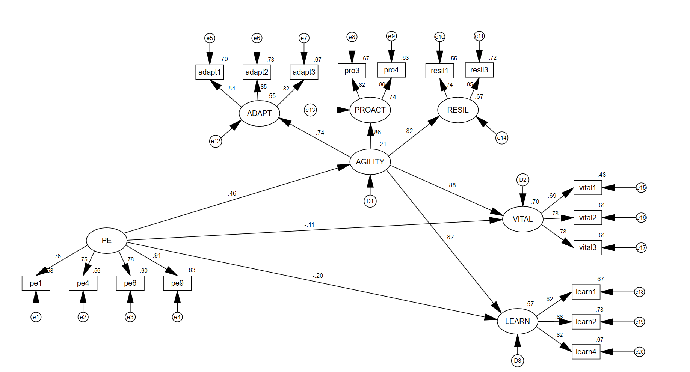

```{r setup, include = FALSE}
# Add R script here
library("papaja")

```

```{r analysis-preferences}
# Seed for random number generation
set.seed(42)
knitr::opts_chunk$set(cache.extra = knitr::rand_seed)
```


# Introduction (****)
test [@R-base]




\newpage

# References

::: {#refs custom-style="Bibliography"}
:::


<!-- comment -->

